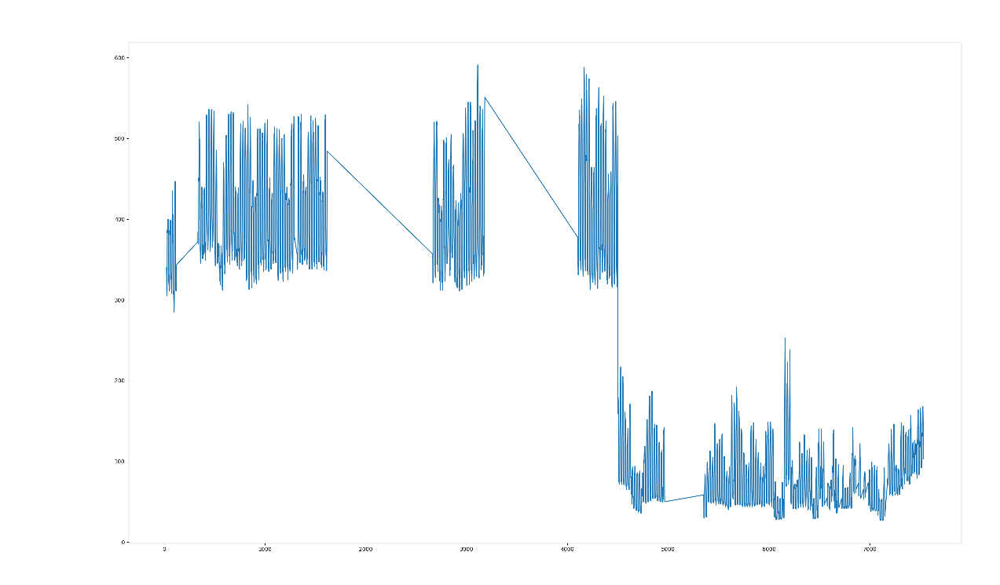
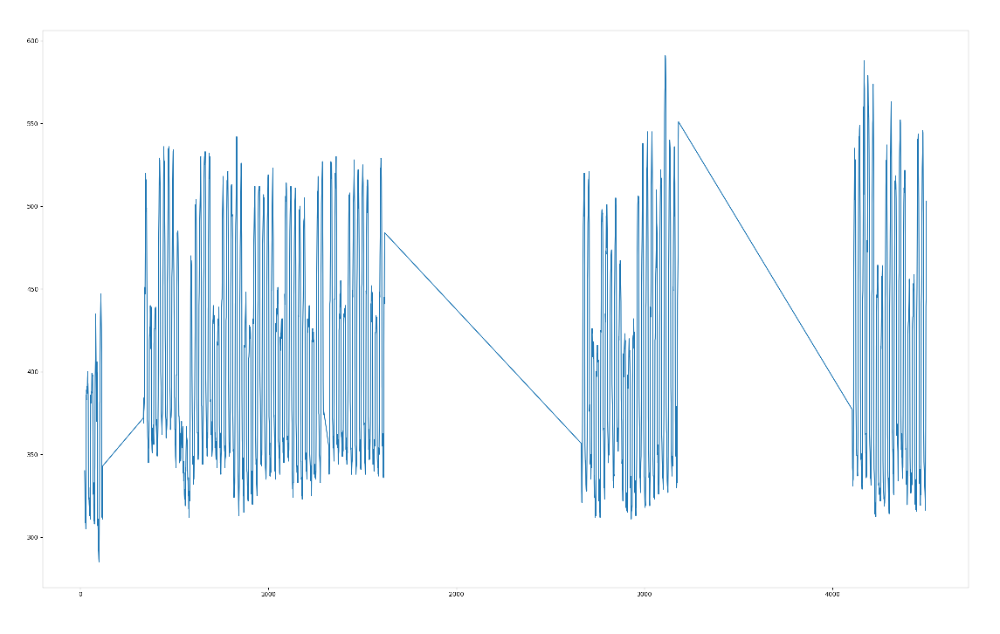
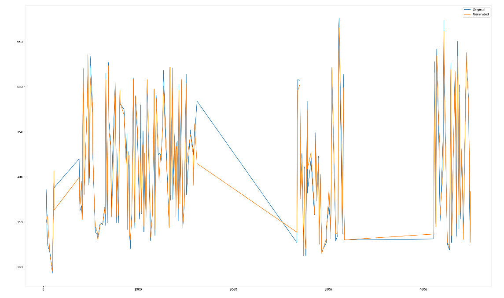
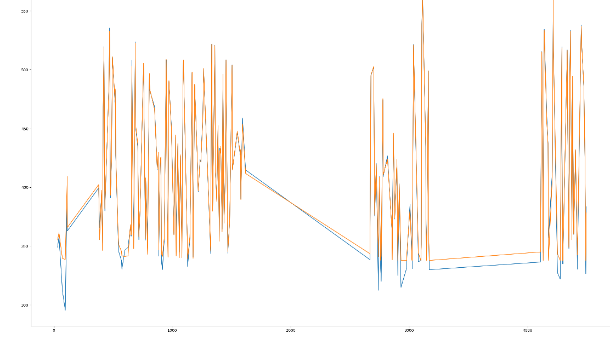

## ABSTRACT

Time series missing values are a common problem in many fields such as finance, meteorology, and healthcare. Missing values occur when observations are not recorded or lost during data collection, and this can lead to biased or inaccurate analysis results. To overcome this issue, generating missing values is necessary to complete the dataset and preserve the time series properties.

However, generating missing values can be challenging, especially when dealing with time series that exhibit trend and seasonal patterns. Trend is the long-term pattern of a time series, while seasonality is the repeating pattern within a shorter time frame. These properties make it difficult to generate missing values that preserve the underlying patterns of the time series, as the generated values must fit within the overall trend and seasonal fluctuations.

Most common techniques for generating missing values, such as linear interpolation or mean imputation, do not tend to preserve the seasonal fluctuations of a time series. This can lead to biased or inaccurate analysis results, especially in applications where the seasonal component is critical, such as in forecasting or anomaly detection.

To overcome this problem, more advanced techniques such as autoencoders can be used. In this project the this approach is explored. The isea is that by training an autoencoder on an incomplete time series dataset, it can learn to capture the important features of the time series, such as trend and seasonality, and use this knowledge to generate missing values.

## DATA PREPARATION

The data was obtained from a Kaggle contest named Large-scale Energy Anomaly Detection (LEAD) https://www.kaggle.com/competitions/energy-anomaly-detection/overview.

This data is a compilation of each data point of electricity meters from approximately 400 commercial buildings. In this project the univariate time series for building number 107 was used. Following there is a graph of the data.

The data is compiled hourly and from this the following fields were created:

- time_sec: it contains a  sequential number built from the 'timestamp' field from which several other fields will be computed. Notice that every time that there is a gap in the sequence is because there are missing values.

- year_quarter_1, year_quarter_2, year_quarter_3, year_quarter_4: These field are populated with 1 if the annotation belongs to a specific quarter, otherwise it is assigned the value 0.0001.

- day_midnight, day_morning, day_afternoon, day_night: These fields are populated with 1 if the annotation belongs to a specific category, otherwise is 0.0001.

- day_holiday: Is assigned to 1 if the timestamp of the observation is in what can be considered a holiday, otherwise is 0.0001.

After, a positional encoding factor is multiplied to each of them to provide the autoencoder with the sense of the time order.

By looking at the time series graph we can see an abrupt descend in the values. It looks like there is a part of the seties that doesen't match with the other, when applying the algorithms described here the resolts were not entirely good so the data was shoped and in the example we use just the first part of the time series, this is shown in the following graph.

Also in this module the anomalies are extracted from the dataset and it is then divided in a training and a testing set. Finally, the test set is estimated by calculating the average of the two adjacent points and this is returned. 

The data preparation is done in the module prepare_data.py.

## GENERATING THE TEST SET BY OBTAINING THE MEAN OF IT ADJACENT POINTS

This is done in order to provide those calculated values to the autoencoder to finally generate the real value and also to calculate how eficient is this method to reconstruct the missing values. The following graphic just show this:

The original value is in blue and the generated ones are in orange.

As you can see this is not so bad aproximation and when the squared average of the errors it gives the number 260.09. 

## USING AN AUTOENCODER TO TRAIN A MODEL EXPEXTED TO BE BETTER AT APROXIMATING THE TEST DATA SET

All the functions used in this part of the project are in the autoencoder_module.py.

The autoencoder will have 10 input variables and it is structured in the following form:

Encoder:
10 - Input layer
10 - Hidden layer
9 - Hidden layer
9 - Hidden layer
8 - Hidden layer
8 - Hidden layer
7 - Hidden layer
7 - Hidden layer
6 - Hidden layer
6 - Bottleneck

Decoder: The decoder has the invers of this structure.

Training of the model is done in the function called 'train_only' with  100 epuchs in batches size that is calculated dividing the length of the dataset by 100.

Since positional encoding was added we suposely wont need to maintain the order and so shuffle=True is used when creating the data loader. The training is done in the function train_only.

## USING THE MODEL TO FINE TUNE THE INTERPOLATION ALREADY DONE USING THE AVERAGE OF THE ADJACENT POINTS.

The function 'execute_evaluate' use the trained module and the average values calculated for test in the data preparation part and generates a new set of values for the test data set.

In the example we run we found that these values outperform the simple interpolation of the data using the average of the adjacent points as shown in the following graph:

The mean of the difference betwen the test data and the generated data was 45.74, compared to 260.09 obtained by by interpolating using averages.

## GENERATING THE MISSING VALUES

This part have not being built yet. The logic is simple, parse the time series and when a missing value appears then generate all the required fields as shown in the data preparation section and feed the 'execute_evaluate' function, then update the time series with this new value and proceed with the next point.

## ADDITIONAL EXPLANATION ABOUT THE autoencoder_module.py

During the project several different approaches was tried, some of the code used in these testing are kept commented because these are options that require more investigation. This will be properly indicated so there is no confusion with the actual code used in the results shown here.

## CONCLUSIONS

Generating missing values is necessary to support the rest of the projects, in the other Repos, using the Fourier Transform for detecting anomalies.

The method described involves the following steps:

- Extending the data with fields representing seasonal patterns
- Adding positional encoding
- Obtaining missing values by averaging the values of its adjacent points
- Training the model
- Running the obtained averages values through the forward pass of the model to obtain a better approximation

This method seams to work. It was tried with the second part of the time series with identical results.

Nevertheless, more research is necessary to determine if this strategy can be proven correct.

Another important issue is to determine why this method doesn't semas to work so well when using the total time series. As an intuition, the model might not be learning much about the trend, of course this time series has an abrupt decline in its values which makes it difficult to model with a simple linear trend. More research is needed on how to extend the input data (incorporating field representing trend) so the autoencoder learns more accurately to correlate values with the sequence of time.

## REFERENCES

 1 -The Intuition behind the Laplace Transform. Panos Michelakis. 2021. https://medium.com/intuition/the-intuition-behind-the-laplace-transform-8432c3bceb37

2- Multivariate Time Series Forecasting Using LSTM, GRU & 1d CNNs. Greg Hogg. 2021. https://www.youtube.com/watch?v=kGdbPnMCdOg  

3- Attention Is All You Need. Ashish Vaswani.2017. file:///C:/Users/ecbey/OneDrive/NY%202012/Documents/AttentionAllNeed.pdf 

